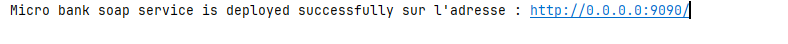

# Compte rendu du service web SOAP 

Ce document présente un service web SOAP développé en Java et testé avec SoapUI. 

## Architecture du service

Le service web est composé de :

* **Entités:**
    * `Account`: classe représentant un compte bancaire avec un code, un solde et une date.
* **Service:**
    * `MicroBank`: classe implémentant les méthodes du service web:
        * `toMAD`: convertit un montant en euros en dirhams marocains.
        * `getAccount`: retourne un compte bancaire en fonction de son code.
        * `getAccounts`: retourne une liste de 50 comptes bancaires.
* **Application:**
    * `BankWSApp`: classe principale déployant le service web sur le port 9090.
* **Utils:**
    * Classe utilitaire pour la génération de données aléatoires.

## Implémentation du service

**Code du service `MicroBank`:**

```java
package ma.amarghad.bankws.service;

import jakarta.jws.WebMethod;
import jakarta.jws.WebParam;
import jakarta.jws.WebService;
import ma.amarghad.bankws.Utils;
import ma.amarghad.bankws.entities.Account;

import java.util.*;
import java.util.stream.Stream;

@WebService(name = "BankWS")
public class MicroBank {

    @WebMethod
    public double toMAD(@WebParam(name="euroAmount") double amountInEuro) {
        return amountInEuro * 15;
    }

    @WebMethod
    public Account getAccount(int code) {
        return new Account(code, Utils.randomAmount(), new Date());
    }

    @WebMethod
    public List<Account> getAccounts() {
        return Stream.generate(Utils::randomAccount)
                .distinct()
                .limit(50)
                .toList();
    }

}
```

## Démarrage et configuration
Le service est déployé sur le port 9090
```java
public class BankWSApp {
    public static void main(String[] args) {
        String adress = "http://0.0.0.0:9090/";
        Endpoint.publish(adress, new MicroBank());
        System.out.printf("Micro bank soap service is deployed successfully sur l'adresse : %s",
                adress);
    }
}
```



## Tests avec SoapUI
La video suivante démontre le test du service à l'aide du  SoapUI :

[](https://www.youtube.com/watch?v=zVCS4-4Wh5k)

## Conclusion

Le service web SOAP développé est fonctionnel et permet de réaliser les opérations souhaitées. Il a été testé avec succès à l'aide de SoapUI.

Ce service peut être utilisé par d'autres applications pour accéder aux informations bancaires.